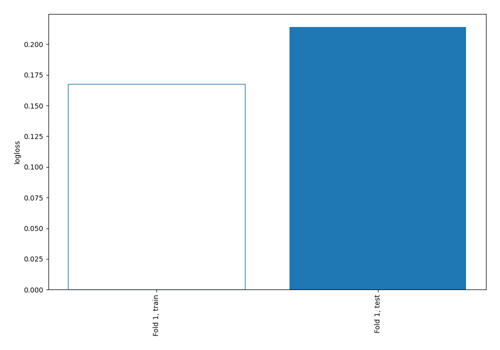
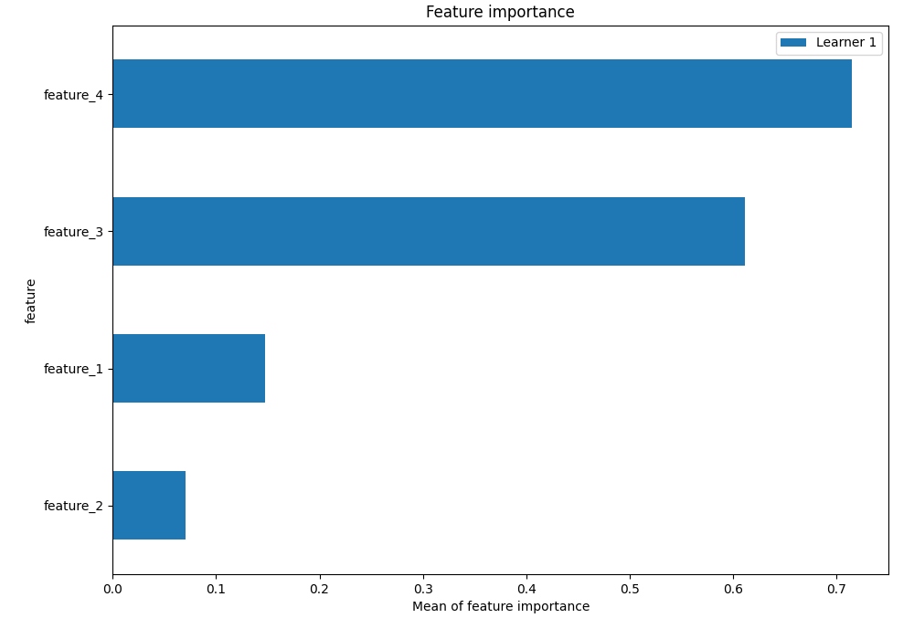
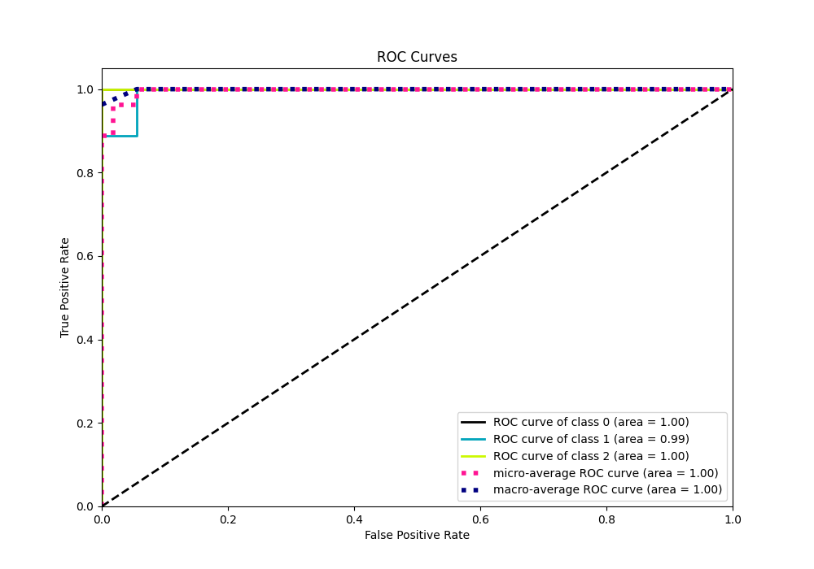
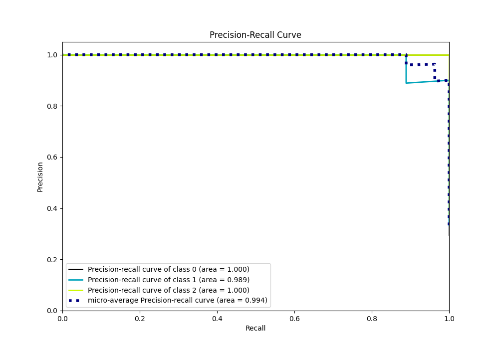

# Summary of 3_Linear

[<< Go back](../README.md)

## Logistic Regression (Linear)
- **n_jobs**: -1
- **num_class**: 3
- **explain_level**: 2

## Validation
 - **validation_type**: split
 - **train_ratio**: 0.75
 - **shuffle**: True
 - **stratify**: True

## Optimized metric
logloss

## Training time

4.2 seconds

### Metric details
|           |   0 |        1 |         2 |   accuracy |   macro avg |   weighted avg |   logloss |
|:----------|----:|---------:|----------:|-----------:|------------:|---------------:|----------:|
| precision |   1 | 1        |  0.909091 |   0.962963 |    0.969697 |       0.96633  |  0.214012 |
| recall    |   1 | 0.888889 |  1        |   0.962963 |    0.962963 |       0.962963 |  0.214012 |
| f1-score  |   1 | 0.941176 |  0.952381 |   0.962963 |    0.964519 |       0.962755 |  0.214012 |
| support   |   8 | 9        | 10        |   0.962963 |   27        |      27        |  0.214012 |

## Confusion matrix
|              |   Predicted as 0 |   Predicted as 1 |   Predicted as 2 |
|:-------------|-----------------:|-----------------:|-----------------:|
| Labeled as 0 |                8 |                0 |                0 |
| Labeled as 1 |                0 |                8 |                1 |
| Labeled as 2 |                0 |                0 |               10 |

## Learning curves

## Coefficients

### Coefficients learner #1
|           |         0 |         1 |         2 |
|:----------|----------:|----------:|----------:|
| intercept | -0.454729 |  1.67643  | -1.2217   |
| feature_1 | -0.801508 |  0.371925 |  0.429583 |
| feature_2 |  1.13941  | -0.407562 | -0.73185  |
| feature_3 | -1.50347  | -0.344381 |  1.84785  |
| feature_4 | -1.46124  | -0.54688  |  2.00812  |

## Permutation-based Importance

## Confusion Matrix

## Normalized Confusion Matrix

## ROC Curve

## Precision Recall Curve

[<< Go back](../README.md)
