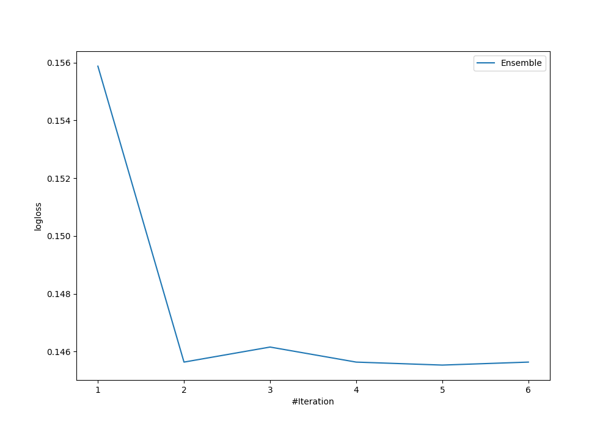
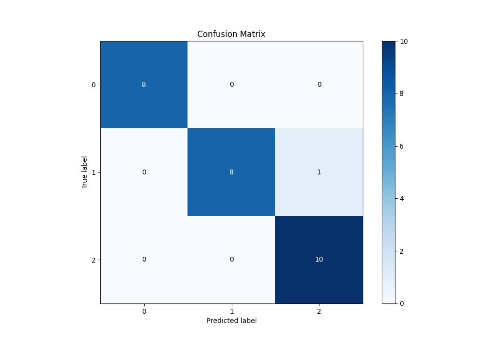
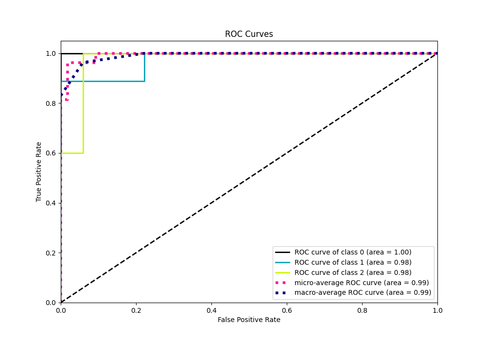
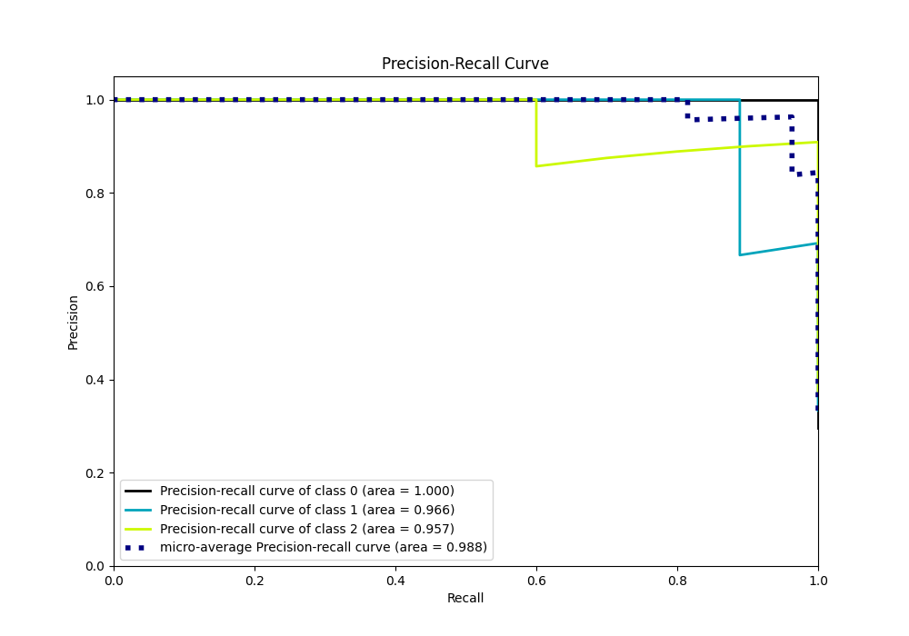

# Summary of Ensemble

[<< Go back](../README.md)

## Ensemble structure
| Model                  |   Weight |
|:-----------------------|---------:|
| 4_Default_Xgboost      |        2 |
| 6_Default_RandomForest |        3 |

### Metric details
|           |   0 |        1 |         2 |   accuracy |   macro avg |   weighted avg |   logloss |
|:----------|----:|---------:|----------:|-----------:|------------:|---------------:|----------:|
| precision |   1 | 1        |  0.909091 |   0.962963 |    0.969697 |       0.96633  |  0.145535 |
| recall    |   1 | 0.888889 |  1        |   0.962963 |    0.962963 |       0.962963 |  0.145535 |
| f1-score  |   1 | 0.941176 |  0.952381 |   0.962963 |    0.964519 |       0.962755 |  0.145535 |
| support   |   8 | 9        | 10        |   0.962963 |   27        |      27        |  0.145535 |

## Confusion matrix
|              |   Predicted as 0 |   Predicted as 1 |   Predicted as 2 |
|:-------------|-----------------:|-----------------:|-----------------:|
| Labeled as 0 |                8 |                0 |                0 |
| Labeled as 1 |                0 |                8 |                1 |
| Labeled as 2 |                0 |                0 |               10 |

## Learning curves

## Confusion Matrix

## Normalized Confusion Matrix

## ROC Curve

## Precision Recall Curve

[<< Go back](../README.md)
