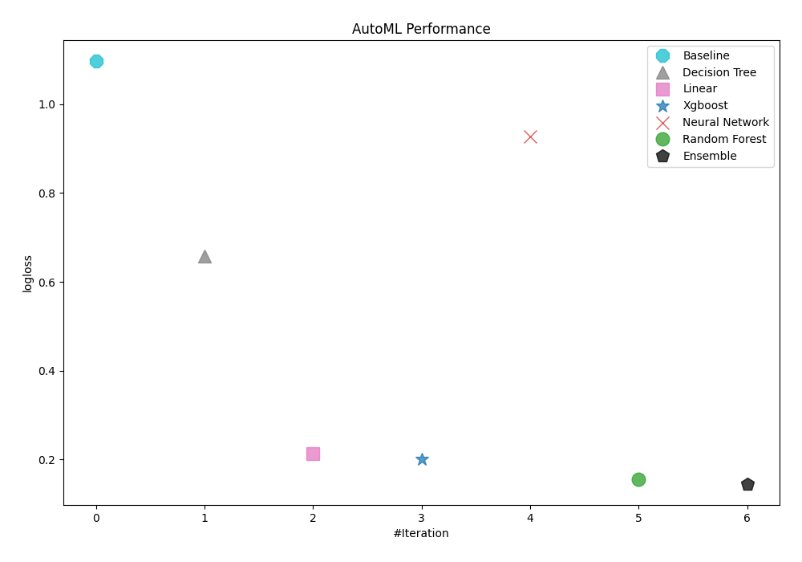
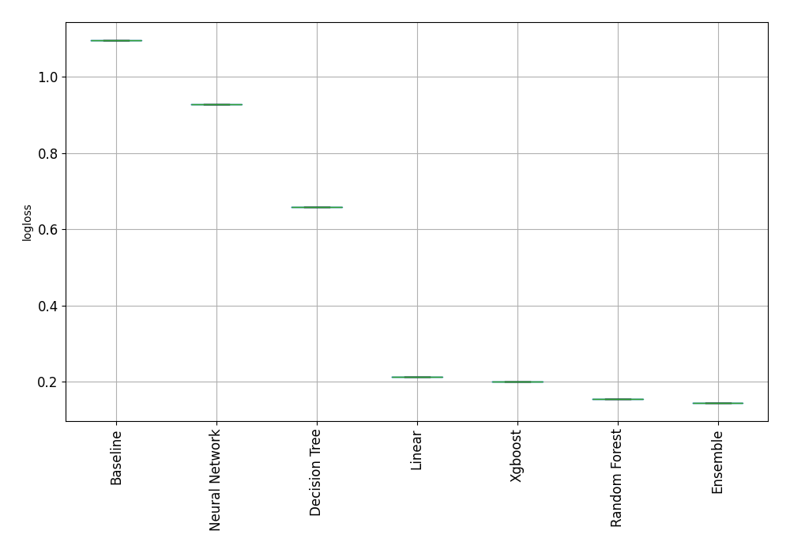
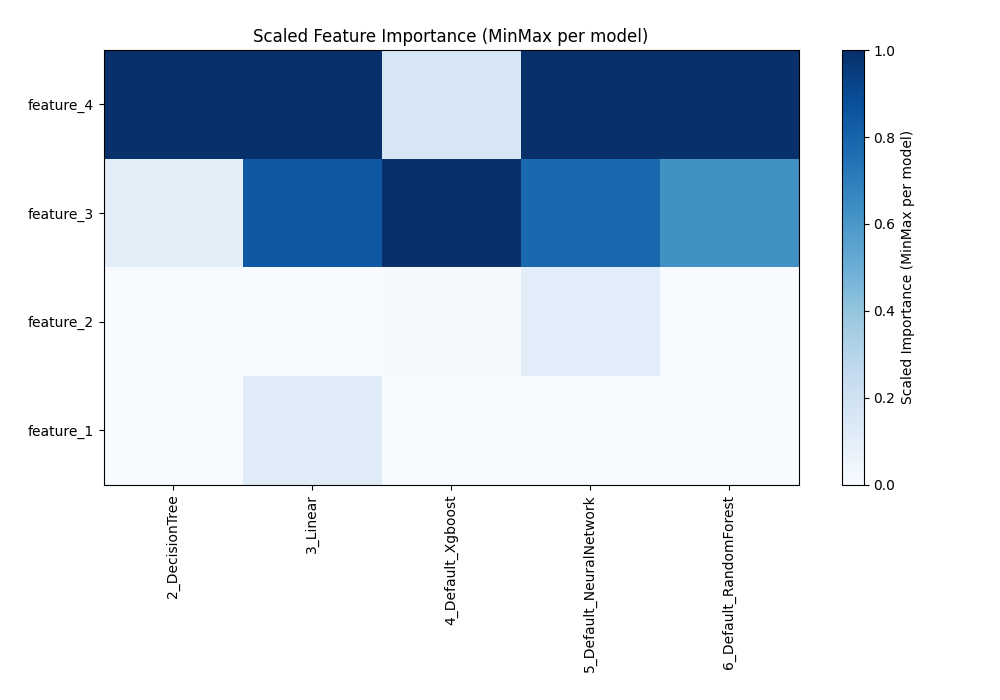
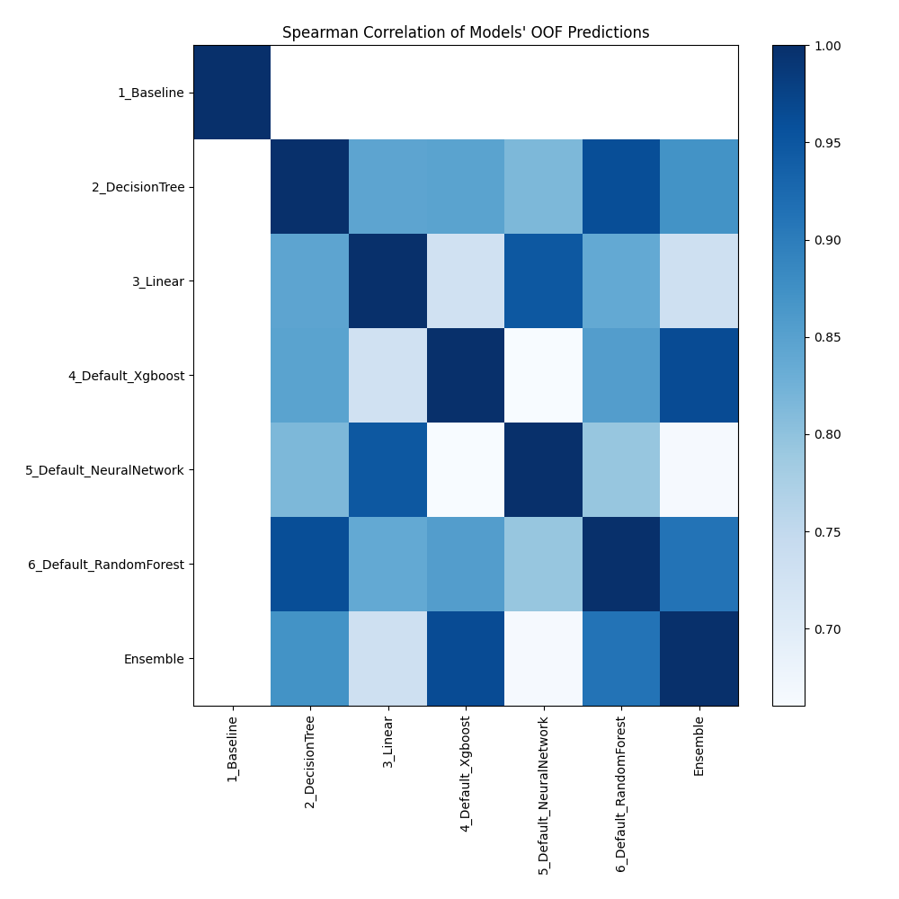

# AutoML Leaderboard

| Best model   | name                                                         | model_type     | metric_type   |   metric_value |   train_time |
|:-------------|:-------------------------------------------------------------|:---------------|:--------------|---------------:|-------------:|
|              | [1_Baseline](1_Baseline/README.md)                           | Baseline       | logloss       |       1.09626  |         0.94 |
|              | [2_DecisionTree](2_DecisionTree/README.md)                   | Decision Tree  | logloss       |       0.658399 |         4.8  |
|              | [3_Linear](3_Linear/README.md)                               | Linear         | logloss       |       0.214012 |         4.92 |
|              | [4_Default_Xgboost](4_Default_Xgboost/README.md)             | Xgboost        | logloss       |       0.201688 |         2.86 |
|              | [5_Default_NeuralNetwork](5_Default_NeuralNetwork/README.md) | Neural Network | logloss       |       0.927183 |         1.29 |
|              | [6_Default_RandomForest](6_Default_RandomForest/README.md)   | Random Forest  | logloss       |       0.155874 |         2.05 |
| **the best** | [Ensemble](Ensemble/README.md)                               | Ensemble       | logloss       |       0.145535 |         0.41 |

### AutoML Performance

### AutoML Performance Boxplot

### Features Importance (Original Scale)

### Scaled Features Importance (MinMax per Model)

### Spearman Correlation of Models

